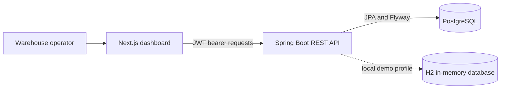

# Stockroom

### Inventory operations, at a glance.

Stockroom is a warehouse inventory dashboard concept built for teams that need a quick read on stock levels, movement, and items that need attention. The interface brings those signals into one calm, scan-friendly workspace, with quick actions for product setup and stock movements.

<p align="center">
	
	
	
	
	
</p>

## Product Preview


*The current responsive dashboard: warehouse overview, movement trends, low-stock alerts, and the product inventory workspace.*

## What You Can Explore

| Workspace | What it shows |
| --- | --- |
| **Inventory overview** | Stock-on-hand, inventory value, low-stock count, and open-operation summary metrics. |
| **Stock movement** | A weekly received-versus-shipped chart and net movement summary. |
| **Replenishment watch** | Reorder thresholds and visual stock-level indicators for items needing attention. |

### Demo Flow

1. Sign in as `admin` with password `1234`.
2. Review stock metrics and low-stock alerts on the dashboard.
3. Search the Products page and create a product through the API.
4. Use Operations to draft and validate receipts, deliveries, transfers, or adjustments; review posted movements in the Ledger.

> **Demo scope:** the frontend reads inventory, warehouse, and document data from the Spring API. Weekly movement bars remain illustrative because no analytics endpoint exists yet. The login accepts one hardcoded local demo administrator; see **Demo Login** below. Signup is disabled until database-backed user management is configured.

### Demo Login

Use **Login ID** `admin` and **Password** `1234`. When the backend is reachable, login returns a signed JWT for the demo administrator. When the backend is unavailable, the frontend permits a local-only demo session so the UI can still be explored. This hardcoded credential is temporary and must not be used in a deployed environment. Signup and profile changes are intentionally disabled for this single-user setup.

## How It Fits Together



The codebase is split into a TypeScript frontend and a Java backend. PostgreSQL schema is versioned with Flyway; stock receipts, deliveries, transfers, and adjustments are recorded through a transactional stock ledger. Local demo runs can use the H2 test database.

## Technology
| Layer | Stack |
| --- | --- |
| Web | Next.js 16, React 19, TypeScript |
| UI | Responsive CSS, Lucide icons |
| API | Java 17, Spring Boot 3.5, Spring Web |
| Persistence | Spring Data JPA, Flyway migrations, PostgreSQL |
| Authentication | Spring Security, BCrypt, signed JWT bearer tokens |
| Backend test/demo | Gradle, Spring Boot Test, H2 in-memory database |

## API Coverage

The API uses `/api` as its base path. All responses use a `success` envelope; paginated resources include `items`, `page`, `limit`, `total`, and `total_pages`.

| Module | Endpoints |
| --- | --- |
| Auth | `POST /auth/signup`, `POST /auth/login`, `POST /auth/otp/request`, `POST /auth/otp/verify`, `GET /auth/me`, `PUT /auth/me` |
| Products and categories | Product list/create/get/update/delete, product ledger, category list/create/get |
| Warehouses and locations | Warehouse list/create/get, warehouse location creation, location list/create |
| Stock ledger | `GET /ledger`, `POST /ledger/movement` |
| Receipts, deliveries, transfers, adjustments | For each: list/create/get, validate, cancel |
| Dashboard | `GET /dashboard/summary`, `GET /dashboard/documents` |

For exact methods and request bodies, import [the Postman collection](backend/postman/Stockroom.postman_collection.json). The full module-by-module sequence is documented in [backend/postman/README.md](backend/postman/README.md).

## Run Locally

### Requirements

- Node.js 20.19+ or 22.13+ and npm
- Java 17 or newer; the Gradle wrapper downloads the pinned Gradle distribution
- PostgreSQL for the normal API run, or use the H2-backed demo/test runtime

### Frontend

```powershell
cd frontend
npm install
npm run dev
```

Open [http://localhost:3000](http://localhost:3000).

### Backend

For the normal API run, create a PostgreSQL database named `inventory_management`, configure credentials, and start the backend:

```powershell
cd backend
.\gradlew.bat bootRun
```

The API listens on port `8080`. Configure a stable JWT signing secret and your local database credentials:

```powershell
$env:DB_URL = "jdbc:postgresql://localhost:5432/inventory_management"
$env:DB_USERNAME = "postgres"
$env:DB_PASSWORD = "postgres"
$env:JWT_SECRET = "replace-with-a-random-secret-at-least-32-characters"
.\gradlew.bat bootRun
```

For an isolated local demo that needs no PostgreSQL credentials, run ` .\gradlew.bat bootTestRun` from `backend/`. It uses H2. The built-in administrator has no database user row, so OTP password reset is not available for that account. Configure persistent users and email delivery before enabling signup or password reset.

Check the API health endpoint:

```powershell
Invoke-RestMethod http://localhost:8080/api/health
```

### Postman

Import [Stockroom.postman_collection.json](backend/postman/Stockroom.postman_collection.json) into Postman. Start the backend with ` .\gradlew.bat bootTestRun`, then run the collection in order. It signs in as the demo administrator, checks the expected signup/profile restrictions, exercises the inventory API groups, and soft-deletes its demo product.

## Frontend Routes

| Route | Purpose |
| --- | --- |
| `/login` | Demo admin sign-in; signup is disabled pending persistent user setup. |
| `/` | API-backed inventory dashboard and low-stock watch. |
| `/products` | Search, filter, and create products. |
| `/operations/receipts` | Draft and validate incoming stock receipts. |
| `/operations/deliveries` | Draft and validate outgoing stock deliveries. |
| `/operations/transfers` | Move stock between warehouse locations. |
| `/operations/adjustments` | Record inventory gain or loss adjustments. |
| `/operations/ledger` | Search posted stock movements. |
| `/settings/warehouses` | Create warehouses and physical locations. |

## Verify

```powershell
# Frontend production build (from the repository root)
cd frontend
npm run build

# Backend context test (from the backend directory)
cd ..\backend
.\gradlew.bat test
```

## Project Layout

```text
Inventory-Management/
├── frontend/
│   ├── public/                 # Dashboard screenshot and static assets
│   └── src/
│       ├── app/                # Next.js app router and global styles
│       ├── components/         # Inventory dashboard and UI components
│       ├── pages/              # Reserved for legacy/standalone pages
│       ├── services/           # API client boundary
│       ├── store/              # Shared client state
│       └── utils/              # Frontend helpers
└── backend/
	├── postman/                # Importable collection and local environment
	└── src/
		├── main/java/com/inventorymanagement/
		│   ├── config/
		│   ├── controller/
		│   ├── dto/
		│   ├── exception/
		│   ├── model/
		│   ├── repository/
		│   └── service/
		├── main/resources/      # application.yaml and Flyway migrations
		└── test/                # Spring context test and H2 settings
```

## Next Up

- Configure persistent user accounts and email delivery before enabling signup and password reset.
- Add role-based permissions beyond the current authenticated-request boundary.
- Add automated workflow tests to the Gradle suite so the full Postman scenarios run in CI.