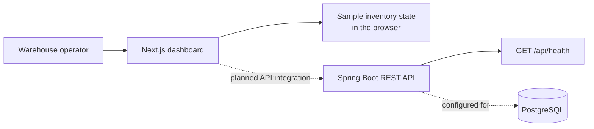

# Stockroom

### Inventory operations, at a glance.

Stockroom is a warehouse inventory dashboard concept built for teams that need a quick read on stock levels, movement, and items that need attention. The interface brings those signals into one calm, scan-friendly workspace, with quick actions for product setup and stock movements.

<p align="center">
	
	
	
	
	
</p>

## Product Preview


*The current responsive dashboard: warehouse overview, movement trends, low-stock alerts, and the product inventory workspace.*

## What You Can Explore

| Workspace | What it shows |
| --- | --- |
| **Inventory overview** | Stock-on-hand, inventory value, low-stock count, and open-operation summary metrics. |
| **Stock movement** | A weekly received-versus-shipped chart and net movement summary. |
| **Replenishment watch** | Reorder thresholds and visual stock-level indicators for items needing attention. |
| **Product inventory** | Searchable sample catalog with SKU, category, quantity, warehouse location, and unit cost. |
| **Quick actions** | Add a product or record a receipt/delivery and see the in-session inventory update. |
| **Warehouse workspace** | Responsive navigation, warehouse context, reports, locations, and settings entry points. |

### Demo Flow

1. Start the web app and scan the four overview metrics.
2. Search by product name, SKU, or bin location to narrow the catalog.
3. Choose **Add product** to add an item to the current demo session.
4. Choose **Record movement** to receive or dispatch units and see the on-hand count change.

> **Demo scope:** all dashboard metrics and catalog entries are illustrative sample data held in browser state. Add-product and stock-movement changes last only for the current session and are not persisted after a refresh. The frontend is not yet connected to the Spring API. The backend currently exposes a health endpoint; PostgreSQL configuration is in place for the next implementation phase.

## How It Fits Together



The codebase is split into a TypeScript frontend and a Java backend. The backend is organized around the planned inventory boundaries: products, warehouses and locations, receipts, deliveries, transfers, adjustments, stock ledger, users, and dashboard summaries.

## Technology

| Layer | Stack |
| --- | --- |
| Web | Next.js 16, React 19, TypeScript |
| UI | Responsive CSS, Lucide icons |
| API | Java 17, Spring Boot 3.5, Spring Web |
| Persistence foundation | Spring Data JPA, PostgreSQL driver |
| Backend test | Spring Boot Test, H2 in-memory database |

## Run Locally

### Requirements

- Node.js 20.19+ or 22.13+ and npm
- Java 17 or newer; the Gradle wrapper downloads the pinned Gradle distribution
- PostgreSQL for running the API against the configured local database

### Frontend

```powershell
cd frontend
npm install
npm run dev
```

Open [http://localhost:3000](http://localhost:3000).

### Backend

Create a PostgreSQL database named `inventory_management`, then run:

```powershell
cd backend
.\gradlew.bat bootRun
```

The API uses port `8080`. Override the local database connection with environment variables when needed:

```powershell
$env:DB_URL = "jdbc:postgresql://localhost:5432/inventory_management"
$env:DB_USERNAME = "postgres"
$env:DB_PASSWORD = "postgres"
.\gradlew.bat bootRun
```

Check the starter endpoint:

```powershell
Invoke-RestMethod http://localhost:8080/api/health
```

Expected response:

```json
{
	"status": "UP",
	"service": "inventory-management-api"
}
```

## A Peek at the Implementation

The add-product interaction validates the submitted values and updates the visible demo catalog immediately:

```tsx
function addProduct(formData: FormData) {
	const name = String(formData.get("name") ?? "").trim();
	const sku = String(formData.get("sku") ?? "").trim();
	const quantity = Number(formData.get("quantity"));
	if (!name || !sku || !Number.isFinite(quantity)) return;

	setItems((current) => [
		{ name, sku, quantity, category: "New item", reorderAt: 10,
			location: "Unassigned", value: 0 },
		...current,
	]);
}
```

The Java starter keeps its health check small and explicit:

```java
@GetMapping("/health")
public Map<String, String> health() {
		return Map.of("status", "UP", "service", "inventory-management-api");
}
```

## Verify

```powershell
# Frontend production build (from the repository root)
cd frontend
npm run build

# Backend context test (from the backend directory)
cd ..\backend
.\gradlew.bat test
```

## Project Layout

```text
Inventory-Management/
├── frontend/
│   ├── public/                 # Dashboard screenshot and static assets
│   └── src/
│       ├── app/                # Next.js app router and global styles
│       ├── components/         # Inventory dashboard and UI components
│       ├── pages/              # Reserved for legacy/standalone pages
│       ├── services/           # API client boundary
│       ├── store/              # Shared client state
│       └── utils/              # Frontend helpers
└── backend/
		└── src/
				├── main/java/com/inventorymanagement/
				│   ├── config/
				│   ├── controller/
				│   ├── dto/
				│   ├── model/
				│   ├── repository/
				│   └── service/
				├── main/resources/      # application.yaml
				└── test/                # Spring context test and H2 settings
```

## Next Up

- Connect the dashboard to the Spring API and replace sample state with persisted data.
- Add product, warehouse, location, receipt, delivery, transfer, and adjustment endpoints.
- Define the PostgreSQL schema and transaction-backed stock ledger.
- Add Spring Security with JWT authentication and role-based access.
- Add automated tests for inventory workflows and the frontend's key interactions.