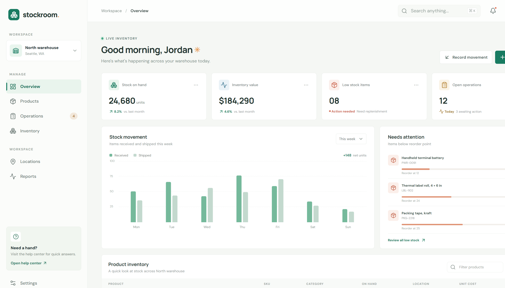
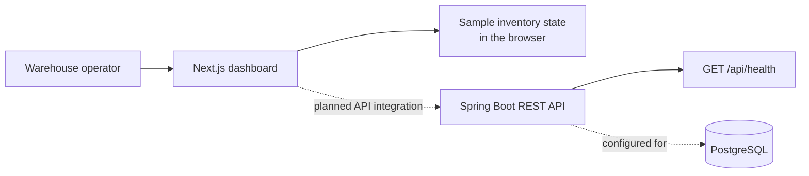

# Stockroom

### Inventory operations, at a glance.

Stockroom is a warehouse inventory dashboard concept built for teams that need a quick read on stock levels, movement, and items that need attention. The interface brings those signals into one calm, scan-friendly workspace, with quick actions for product setup and stock movements.

<p align="center">
	
	
	
	
	
</p>

## Product Preview



*The current responsive dashboard: warehouse overview, movement trends, low-stock alerts, and the product inventory workspace.*

## What You Can Explore

| Workspace | What it shows |
| --- | --- |
| **Inventory overview** | Stock-on-hand, inventory value, low-stock count, and open-operation summary metrics. |
| **Stock movement** | A weekly received-versus-shipped chart and net movement summary. |
| **Replenishment watch** | Reorder thresholds and visual stock-level indicators for items needing attention. |
| **Product inventory** | Searchable sample catalog with SKU, category, quantity, warehouse location, and unit cost. |
| **Quick actions** | Add a product or record a receipt/delivery and see the in-session inventory update. |
| **Warehouse workspace** | Responsive navigation, warehouse context, reports, locations, and settings entry points. |

### Demo Flow

1. Start the web app and scan the four overview metrics.
2. Search by product name, SKU, or bin location to narrow the catalog.
3. Choose **Add product** to add an item to the current demo session.
4. Choose **Record movement** to receive or dispatch units and see the on-hand count change.

> **Demo scope:** dashboard metrics and catalog entries are illustrative sample data held in browser state. The frontend has not yet been connected to the API, so its quick-action changes are not persisted. The Spring backend now exposes the inventory, warehouse, stock-ledger, document, dashboard, and JWT authentication APIs described below.

## How It Fits Together



The codebase is split into a TypeScript frontend and a Java backend. PostgreSQL schema is versioned with Flyway; stock receipts, deliveries, transfers, and adjustments are recorded through a transactional stock ledger. Local demo runs can use the H2 test database.

## Technology

| Layer | Stack |
| --- | --- |
| Web | Next.js 16, React 19, TypeScript |
| UI | Responsive CSS, Lucide icons |
| API | Java 17, Spring Boot 3.5, Spring Web |
| Persistence | Spring Data JPA, Flyway migrations, PostgreSQL |
| Authentication | Spring Security, BCrypt, signed JWT bearer tokens |
| Backend test/demo | Gradle, Spring Boot Test, H2 in-memory database |

## API Coverage

The API uses `/api` as its base path. All responses use a `success` envelope; paginated resources include `items`, `page`, `limit`, `total`, and `total_pages`.

| Module | Endpoints |
| --- | --- |
| Auth | `POST /auth/signup`, `POST /auth/login`, `POST /auth/otp/request`, `POST /auth/otp/verify`, `GET /auth/me`, `PUT /auth/me` |
| Products and categories | Product list/create/get/update/delete, product ledger, category list/create/get |
| Warehouses and locations | Warehouse list/create/get, warehouse location creation, location list/create |
| Stock ledger | `GET /ledger`, `POST /ledger/movement` |
| Receipts, deliveries, transfers, adjustments | For each: list/create/get, validate, cancel |
| Dashboard | `GET /dashboard/summary`, `GET /dashboard/documents` |

For exact methods and request bodies, import [the Postman collection](backend/postman/Stockroom.postman_collection.json). The full module-by-module sequence is documented in [backend/postman/README.md](backend/postman/README.md).

## Run Locally

### Requirements

- Node.js 20.19+ or 22.13+ and npm
- Java 17 or newer; the Gradle wrapper downloads the pinned Gradle distribution
- PostgreSQL for the normal API run, or use the H2-backed demo/test runtime

### Frontend

```powershell
cd frontend
npm install
npm run dev
```

Open [http://localhost:3000](http://localhost:3000).

### Backend

For the normal API run, create a PostgreSQL database named `inventory_management`, configure credentials, and start the backend:

```powershell
cd backend
.\gradlew.bat bootRun
```

The API listens on port `8080`. Configure a stable JWT signing secret and your local database credentials:

```powershell
$env:DB_URL = "jdbc:postgresql://localhost:5432/inventory_management"
$env:DB_USERNAME = "postgres"
$env:DB_PASSWORD = "postgres"
$env:JWT_SECRET = "replace-with-a-random-secret-at-least-32-characters"
.\gradlew.bat bootRun
```

For an isolated local demo that needs no PostgreSQL credentials, run `.\gradlew.bat bootTestRun` from `backend/`. It uses H2 and exposes a reset OTP in the response for the local Postman sequence; do not enable OTP code exposure outside a local demo.

Check the starter endpoint:

```powershell
Invoke-RestMethod http://localhost:8080/api/health
```

Expected response:

```json
{
	"success": true,
	"data": {
		"status": "UP",
		"service": "inventory-management-api"
	}
}
```

### Postman

Import [Stockroom.postman_collection.json](backend/postman/Stockroom.postman_collection.json) into Postman. Start the backend with `.\gradlew.bat bootTestRun` for the self-contained demo sequence, then run the collection in order. It creates a temporary user and sample records, carries the JWT and generated IDs between requests, and exercises all API groups. It ends by soft-deleting its demo product.

## A Peek at the Implementation

The add-product interaction validates the submitted values and updates the visible demo catalog immediately:

```tsx
function addProduct(formData: FormData) {
	const name = String(formData.get("name") ?? "").trim();
	const sku = String(formData.get("sku") ?? "").trim();
	const quantity = Number(formData.get("quantity"));
	if (!name || !sku || !Number.isFinite(quantity)) return;

	setItems((current) => [
		{ name, sku, quantity, category: "New item", reorderAt: 10,
			location: "Unassigned", value: 0 },
		...current,
	]);
}
```

The health endpoint follows the common response envelope:

```java
@GetMapping("/health")
public ApiResponse<Map<String, String>> health() {
    return ApiResponse.ok(Map.of("status", "UP", "service", "inventory-management-api"));
}
```

## Verify

```powershell
# Frontend production build (from the repository root)
cd frontend
npm run build

# Backend context test (from the backend directory)
cd ..\backend
.\gradlew.bat test
```

## Project Layout

```text
Inventory-Management/
├── frontend/
│   ├── public/                 # Dashboard screenshot and static assets
│   └── src/
│       ├── app/                # Next.js app router and global styles
│       ├── components/         # Inventory dashboard and UI components
│       ├── pages/              # Reserved for legacy/standalone pages
│       ├── services/           # API client boundary
│       ├── store/              # Shared client state
│       └── utils/              # Frontend helpers
└── backend/
	├── postman/                # Importable collection and local environment
	└── src/
		├── main/java/com/inventorymanagement/
		│   ├── config/
		│   ├── controller/
		│   ├── dto/
		│   ├── exception/
		│   ├── model/
		│   ├── repository/
		│   └── service/
		├── main/resources/      # application.yaml and Flyway migrations
		└── test/                # Spring context test and H2 settings
```

## Next Up

- Connect the dashboard to the Spring API and replace sample browser state with persisted data.
- Configure real email delivery for password-reset OTPs; the local demo can expose a one-time code only when explicitly enabled.
- Add role-based permissions beyond the current authenticated-request boundary.
- Add automated workflow tests to the Gradle suite so the full Postman scenarios run in CI.